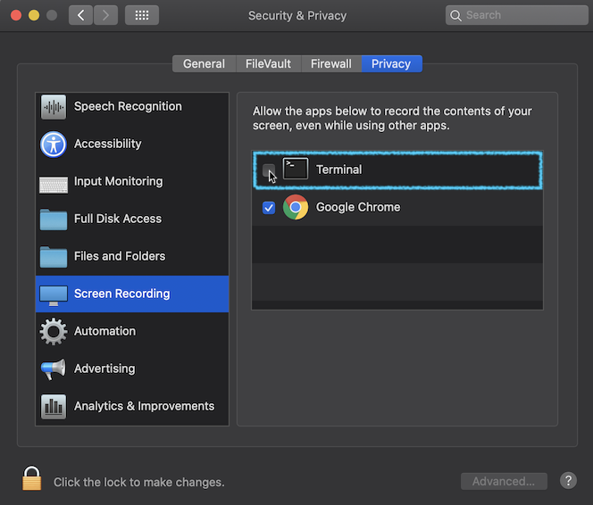

# Negative 2

> This repository is Work In-Progress. At this time, setup requires cloning the repository, installing all developer dependencies, and launching the app via command line. As we add features, we'll expand upon this README.

## Setup

1. `git clone https://github.com/atdrago/negative-react.git`
2. `cd negative-react`
3. `nvm use` (Assuming you have installed Node using NVM)
4. `npm install`
5. `npm start`

## Usage

### Security

On your first screenshot, you'll be asked to update your security settings. The location the app was launched from will appear in settings for you to click and allow.

If you ran `npm start` in "Terminal", for example, you would see the above

### Global Shortcut

The global shortcut to refocus Negative is `CommandOrControl+Alt+G`, which means different things for each OS:

- macOS: **`Command+Option+G`**
- Windows and Linux: **`Control+Alt+G`**
