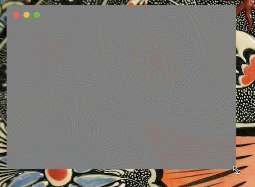

# Negative 2

> This repository is Work In-Progress. At this time, setup requires cloning the repository, installing all developer dependencies, and launching the app via command line. As we add features, we'll expand upon this README.

## Setup

1. `git clone https://github.com/atdrago/negative-react.git`
2. `cd negative-react`
3. `nvm use` (Assuming you have installed Node using NVM)
4. `npm install`
5. `npm start`

## Security

When you take your first screenshot, you'll be asked to update your security settings. The location the app was launched from will appear in settings for you to click and allow.

If you ran `npm start` in "Terminal", for example, you would see the above

## Usage

### Quick Start

Follow [Setup](#setup) and [Security](#security) above.

Negative starts in **Capture mode**. Press `Escape` to exit, or click and drag to capture a region of the screen.

After the capture completes, Negative enters **View mode**.

### Global Shortcuts

If Negative is open, there are two shortcuts that can be used globally:

#### Capture

- macOS: **`Shift` + `Option` + `Command` + `G`**
- Windows and Linux: **`Shift` + `Alt` + `Control` + `G`**

#### Hide and Show

- macOS: **`Shift` + `Option` + `Command` + `H`**
- Windows and Linux: **`Shift` + `Alt` + `Control` + `H`**

### App Shortcuts

#### Moving the "View" window by 1px

- macOS: **`Command` + `←` , `↑` , `→` , `↓`**
- Windows and Linux: **`Control` + `←` , `↑` , `→` , `↓`**

#### Moving the "View" window by 10px

- macOS: **`Shift` + `Command` + `←` , `↑` , `→` , `↓`**
- Windows and Linux: **`Shift` + `Control` + `←` , `↑` , `→` , `↓`**
